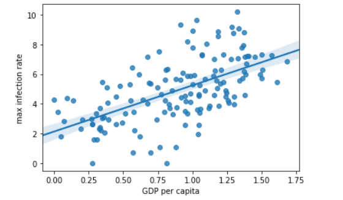

# Data-Analysis-on-COVID-19-Dataset
Preprocessing and merging of COVID-19 datasets to calculate needed measures and prepare them for an Analysis using Numpy, Pandas, Seaborn and Matplotlib. The datasets consists of the data related to the cumulative number of confirmed cases, per day, various life factors, scored by the people living in each country around the globe.

The above graph shows Visualizing data related to a country 

Caculating the first derivative of the curve

Plotting GDP vs maximum Infection rate
